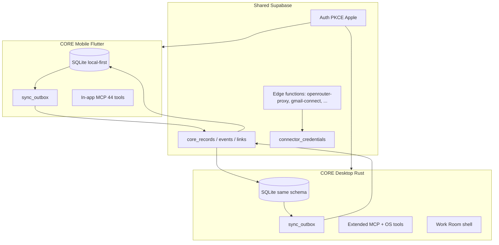

# CORE Desktop Companion — Feature & Architecture Plan

## Repo recommendation: **new repo** (not a subdirectory in `core`)

| Approach | Verdict |
|----------|---------|
| **New repo** (`core-desktop` or `brian-desktop`) | **Recommended** |
| Subdirectory in [`core`](c:\Users\georg\Documents\github\core) | Possible but fights mixed Flutter/Rust CI, release cadence, and binary size |

**Why separate:**

- Mobile [`core`](c:\Users\georg\Documents\github\core) is a **single Flutter package** (`core_os`) with no Rust toolchain today; desktop is a greenfield **Rust + native WebView** stack (Tauri 2 is the natural fit for Windows/macOS, system tray, deep links, and future OS automation).
- [`supabase/`](c:\Users\georg\Documents\github\core\supabase) migrations and edge functions **must remain in the mobile repo** as the schema source of truth. Desktop consumes the same project URL + anon key; it does **not** own migrations.
- Avoid coupling desktop release blockers to iOS TestFlight / Codemagic.

**How to link without drift:**

```
core (Flutter)                    core-desktop (Rust/Tauri)
├── supabase/migrations/  ──────► same Supabase project (read-only consumer)
├── docs/agent/CORE_DATA_MODEL.md ─► contract tests / code-gen
├── docs/agent/SYNC_STRATEGY.md
└── docs/agent/WIDGET_AGENT_METADATA_SEED.json ─► widget catalog parity
```

Use one of:

1. **Git submodule** `core-contracts/` (JSON schemas + generated Rust types) maintained in `core`, imported by desktop; or
2. **CI sync job** in desktop repo that pulls seed JSON + schema docs from `core` on tag.

Do **not** duplicate Supabase SQL in the desktop repo.

---

## High-level architecture



**Principle:** Desktop is **local-first** like mobile—not a Supabase-direct CRUD client. All writes go through the same changelog/outbox contract documented in [`docs/agent/SYNC_STRATEGY.md`](c:\Users\georg\Documents\github\core\docs\agent\SYNC_STRATEGY.md).

---

## Feature requirements

### 1. Shared cloud layer (both apps)

| Requirement | Detail |
|-------------|--------|
| **Shared Supabase project** | Same `SUPABASE_URL` + anon key; desktop registers as `devices.platform = windows` or `macos` via existing [`DeviceRegistrationService`](c:\Users\georg\Documents\github\core\lib\core\supabase\device_registration_service.dart) pattern |
| **Auth** | Sign in with Apple via browser OAuth + custom URL scheme (`com.celix.core://login-callback` today—**desktop needs its own redirect URI** registered in Supabase dashboard, e.g. `com.celix.core.desktop://login-callback`) |
| **Workspace** | Single-owner personal workspace per user ([`002_auth_bootstrap.sql`](c:\Users\georg\Documents\github\core\supabase\migrations\002_auth_bootstrap.sql)); load via `owner_id` |
| **CORE sync** | Push: outbox drain → `core_records` / `core_events` / `core_links`. Pull: incremental by `updated_at` cursor. LWW on `revision` |
| **Shared plan files & timeline** | `project` records + `parent_of` links; timeline from `task`, `timeline_item` kinds; Plan Mode markdown exports per [`plan_markdown_exporter.dart`](c:\Users\georg\Documents\github\core\lib\core\outlets\plan_markdown_exporter.dart) |
| **Widget syncing** | `widget_instance` records: `widgetType`, grid `posX/Y`, `width/height`, `configJson` per [`WIDGET_RUNTIME.md`](c:\Users\georg\Documents\github\core\docs\agent\WIDGET_RUNTIME.md) |
| **Service connections** | Connector **metadata** in `core_records` kind `connector`; tokens either per-device Keychain (**on_device**) or server `connector_credentials` (**cloud_managed**)—see pitfalls below |
| **2-way communication** | **Not provided by current sync** (no Realtime). v1: fast poll on resume + manual sync; v1.5: Supabase Realtime channel or `companion_signal` CORE records for push-to-peer hints |
| **Theming** | User choice: **synced** (store in `app_setting` CORE records—migrate mobile off SharedPreferences) or **per-device** (local prefs only) |
| **AI options** | (a) Cloud via Supabase `openrouter-proxy` when signed in, (b) user BYOK OpenRouter, (c) local model (Ollama/llama.cpp on desktop—mobile cannot use this path) |

### 2. Main dashboard (homepage)

Mirror mobile **timeline-first + drawer customization** pattern from [`home_hub_screen.dart`](c:\Users\georg\Documents\github\core\lib\screens\home_hub_screen.dart):

| Zone | Requirements |
|------|----------------|
| **Timeline section** | Vertical spine, Today pill, project cards; layout prefs (spine position, density) with optional sync |
| **Widget grid** | Drag, resize, lock, undo—same grid semantics as [`DashboardGrid`](c:\Users\georg\Documents\github\core\lib\layout\dashboard_grid.dart); `WidgetConfig` shape: `layout`, `colors`, `extras` |
| **Marketplace tab** | Registry-driven catalog from shared seed JSON; filter by category/surface; install → `widget_instance` write |
| **Brian Assist** | Chat panel; model-first MCP orchestration; preview/confirm for mutations (port contract from [`core_mcp_orchestrator.dart`](c:\Users\georg\Documents\github\core\lib\core\mcp\core_mcp_orchestrator.dart)) |
| **Work Room entry** | Launch/focus Work Room; show active session indicator |
| **Customization** | Fully customizable like mobile widgets page: per-instance layout/colors, decorative groups, dashboard snapshots |

**Desktop-only widget extensions** (new `widgetType` values registered in both catalogs):

- `paste_history`, `calculator`, `canvas_whiteboard`, `ssh_terminal` (already exists on mobile but desktop-native)
- Work Room launcher tile

### 3. Work Room (primary desktop feature)

A dedicated multi-pane workspace (tabs or tiling WM):

| Pane | v1 requirement | v1.5 / optional |
|------|----------------|-----------------|
| **Browser** | Embedded WebView (Tauri WebView or `wry`); agent can navigate, extract, fill forms (with user confirm) | Extension bridge |
| **Notebook** | Markdown-native editor (lightweight, sync as `capture` or plan doc); live preview | Wikilinks, CORE capture ingest |
| **Spreadsheet** | Simple grid (CSV import/export, formulas-lite) | OnlyOffice Calc embed |
| **Slides** | Markdown-to-slides or simple deck builder | OnlyOffice Impress embed |
| **Word processor** | Rich markdown + export DOCX | OnlyOffice Writer embed (hybrid path) |
| **Lightweight IDE** | Monaco or CodeMirror in WebView; open folder; terminal panel | LSP, git status |
| **Toolbox** | Optional docked widgets: calculator, canvas/whiteboard, paste history, clip visualizer | User-addable from marketplace |

**Work Room state:** persist layout (pane sizes, open tabs, file paths) as `app_setting` or new `workroom_session` kind—**define in `core` migration before desktop ships** to avoid orphan local-only JSON.

### 4. Desktop-only: agent full control

Current mobile MCP is **in-app only** (44 tools, preview/confirm). Desktop extends with **OS capability tier** (always confirm for destructive ops):

| Capability | Examples |
|------------|----------|
| **Filesystem** | Read/write user-granted directories; open files in Work Room |
| **Shell** | Run commands in scoped terminal (extends existing `ssh_terminal` concept locally) |
| **Window/UI** | Focus Work Room panes, split layout, open URLs in embedded browser |
| **Clipboard** | Read/write paste history widget |
| **Connectors** | Desktop-native OAuth for Gmail/GitHub (mobile Google inlet is **iOS-only** today) |

**Safety:** Keep model-first + preview/confirm for mutations; separate **AssistToolsLevel** for OS tools vs CORE tools. Never bypass RLS or use `service_role` in the client.

### 5. Non-functional requirements

- **Offline:** Full local SQLite operation; queue outbox when cloud unavailable
- **Privacy:** Respect `CoreRuntimeMode.local_only`—no cloud ASSIST or sync when user chose local-only on any device (store as account-level `app_setting` with per-device override UX)
- **Parity tests:** Contract tests assert desktop Rust types match [`core_models.dart`](c:\Users\georg\Documents\github\core\lib\core\data\core_models.dart) kinds and payload keys
- **Bundle fallback:** Support `core_bundle_v1.json` import/export like [`CoreBundleService`](c:\Users\georg\Documents\github\core\lib\core\data\core_bundle_service.dart) for disaster recovery until full multi-device sync matures

---

## Critical integration pitfalls (will cause real errors)

### Sync & data

1. **Do not read/write Supabase tables directly for product state.** Mobile uses local-first + outbox. Desktop must implement the same push/pull clients or edits will fight LWW and produce `stale_revision` failures.
2. **Client-generated UUIDs must be stable.** Record IDs are `Uuid().v4()` at creation; re-creating the same logical task on desktop creates duplicates.
3. **Every push needs `user_id` + `workspace_id`.** RLS [`user_owns_workspace`](c:\Users\georg\Documents\github\core\supabase\migrations\003_rls_hardening.sql) rejects wrong workspace stamps.
4. **No full bidirectional restore yet.** Pull merges server-originated rows by cursor only—expect gaps until Part C2 sync ships; use bundle export as safety net.
5. **No conflict UI.** Last-writer-wins on `revision`; simultaneous edits on phone + desktop silently overwrite.
6. **Per-device cursors.** `core_sync_last_pull_at` and `core_cloud_device_id` are per install—signing in on desktop does not clone mobile's SQLite.
7. **`revision` must monotonically increase** on each local write before push.

### Auth & OAuth

8. **Desktop redirect URI is separate.** Register `com.celix.core.desktop://login-callback` (or similar) in Supabase Auth settings; do not assume mobile deep link works on Windows.
9. **Apple Sign In on Windows** uses browser OAuth flow only (no native sheet)—match [`auth_service.dart`](c:\Users\georg\Documents\github\core\lib\core\supabase\auth_service.dart) web path.
10. **Never ship `service_role` key** in the desktop binary—anon key + user JWT only ([`SECURITY.md`](c:\Users\georg\Documents\github\core\SECURITY.md)).

### Connectors (Gmail, GitHub, etc.)

11. **OAuth tokens are not synced for on_device mode.** Each device has its own Keychain/credential store; connector row in Supabase is metadata only.
12. **Google inlet on mobile is iOS-only.** Desktop must implement its own Google OAuth or use **cloud_managed** path via [`gmail-connect`](c:\Users\georg\Documents\github\core\supabase\functions\gmail-connect\index.ts) edge function.
13. **`connectionsCloudSyncEntitled = false`** in mobile—cloud-managed inlets are scaffolded but not product-enabled; enabling for desktop requires coordinated mobile + Supabase + entitlement work.
14. **Sign-out clears local credentials** on mobile; desktop must mirror or stale connector state persists locally.

### Widgets & UI parity

15. **`widgetType` strings must match exactly** across apps—catalog driven by [`built_in_widget_catalog.dart`](c:\Users\georg\Documents\github\core\lib\core\widget_engine\built_in_widget_catalog.dart) and [`WIDGET_AGENT_METADATA_SEED.json`](c:\Users\georg\Documents\github\core\docs\agent\WIDGET_AGENT_METADATA_SEED.json).
16. **`configJson` schema** includes `layout`, `colors` (slot → `#AARRGGBB`), `extras`—desktop renderer must parse the same shape or synced widgets render broken.
17. **Grid column count differs by viewport.** Mobile uses responsive columns ([`grid_layout_engine.dart`](c:\Users\georg\Documents\github\core\lib\layout\grid_layout_engine.dart)); desktop wide layout must clamp positions on load or tiles overlap/off-screen.
18. **Theme is device-local today** (`theme_mode`, `accent_palette` in SharedPreferences)—if user expects synced theme, migrate both apps to `app_setting` records first.

### AI / Assist

19. **Cloud ASSIST requires signed-in JWT** for `openrouter-proxy`—local-only mode blocks cloud entirely.
20. **Assist prefs are device-local** (model id, tools level, fast mode)—document as per-device unless synced via `app_setting`.
21. **Embeddings differ by platform** (iOS MiniLM vs tfidf)—memory search quality will not match; desktop should use tfidf or ship its own embedding model consistently.
22. **Agent session state is not synced** (`agent_session_summary` partially in CORE but chat history is local)—do not assume continued conversation across devices without new sync design.

### Schema evolution

23. **New record kinds** (e.g. `workroom_session`, desktop-only settings) require a migration in **`core/supabase/migrations/`** first, then Rust + Dart parsers updated—shipping desktop-only kinds without migration breaks mobile imports.
24. **Unknown kinds fail closed** per [`CORE_DATA_MODEL.md`](c:\Users\georg\Documents\github\core\docs\agent\CORE_DATA_MODEL.md)—mobile app may reject records desktop creates if kinds are not in `CoreRecordKind`.

---

## Recommended tech stack (Rust desktop)

| Layer | Choice | Rationale |
|-------|--------|-----------|
| App shell | **Tauri 2** | Windows + macOS, system tray, deep links, WebView for browser/Monaco/OnlyOffice |
| Local DB | **rusqlite** | Mirror CORE schema (`core_records`, `core_events`, `core_links`, `sync_outbox`) |
| UI | **egui** or **Slint** for native chrome + WebView panes for Work Room | egui fits Rust-native dashboard; WebView for office/browser |
| Sync | Rust port of push/pull clients | Match [`supabase_core_sync_push_client.dart`](c:\Users\georg\Documents\github\core\lib\core\data\supabase_core_sync_push_client.dart) |
| Auth | `supabase-auth` HTTP + PKCE + keyring | Store session in OS keychain |
| AI | HTTP to OpenRouter / Ollama; MCP orchestrator in Rust | Port tool schemas from [`core_mcp_registry.dart`](c:\Users\georg\Documents\github\core\lib\core\mcp\core_mcp_registry.dart) |
| OnlyOffice (v1.5) | Self-hosted or ONLYOFFICE Desktop Editors integration | Hybrid doc path per your choice |

---

## Phased delivery

### Phase 0 — Contracts (both repos)
- Publish CORE record/sync JSON schemas from `core`
- Desktop repo scaffold + auth + SQLite + read-only projections (tasks, timeline, widgets)
- Contract tests

### Phase 1 — Dashboard parity
- Widget grid + marketplace (read shared seed)
- Timeline panel
- Brian Assist (cloud proxy + BYOK)
- Push/pull sync with outbox

### Phase 2 — Work Room (lightweight)
- Browser + markdown notebook + grid spreadsheet + Monaco IDE
- Toolbox widgets
- Work Room layout persistence (new `app_setting` kind)

### Phase 3 — Desktop agent + connectors
- OS tool tier with preview/confirm
- Desktop Gmail/GitHub OAuth
- Paste history / clipboard / canvas widgets

### Phase 4 — Polish & hybrid office
- OnlyOffice embed for heavy docs
- Theme sync option (`app_setting`)
- Realtime companion signals (optional)
- Mobile PRs to migrate theme/assist prefs to syncable records

---

## Mobile repo changes required (coordinate, not block Phase 0)

These are **follow-up PRs in `core`**, not in desktop-only code:

- Add `app_setting` keys for theme sync (optional account flag)
- Register desktop OAuth redirect in Supabase config
- Extend `devices.platform` handling (already has `windows`/`macos` labels)
- Add any new `widgetType` entries to catalog + regenerate seed
- Migration for `workroom_session` / companion message kinds if needed
- Harden multi-device sync (Part C2) before marketing "seamless sync"

---

## Success criteria

- Same Apple account on iPhone + desktop shows same tasks, plans, and widget layouts after sync
- Creating a task on desktop appears on mobile after outbox drain (and vice versa) without duplicate IDs
- Brian can mutate CORE data with preview/confirm on both platforms
- Work Room opens browser + notebook + IDE; agent can drive them with explicit user approval
- User can run cloud ASSIST, BYOK, or local Ollama on desktop
- Theme can be per-device or synced (user toggle)
