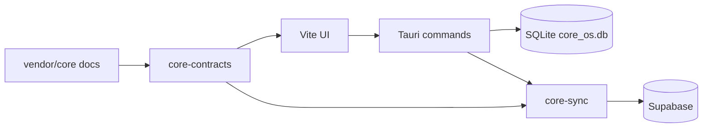

# Architecture

Brian Desktop is a **local-first** companion to CORE mobile. It shares the Supabase project and agent contracts but owns its own release cadence and Rust toolchain.

## Repository layout

```
brian-desktop/
├── src/                    # Vite + TypeScript UI shell (dashboard UI lands in plan)
├── src-tauri/              # Tauri 2 host, IPC commands, app lifecycle
├── crates/
│   ├── core-contracts/     # Paths + loaders for vendor/core agent docs
│   ├── core-db/            # SQLite schema mirror (mobile parity)
│   ├── core-sync/          # Push/pull client traits (SYNC_STRATEGY.md)
│   └── core-mcp/           # ASSIST tool registry + OS tier stubs
├── vendor/core/            # git submodule — schema + contracts (read-only)
└── contracts/              # reserved for generated types / CI snapshots
```

## Data flow



**Rules (from integration plan):**

- All product writes go through local SQLite + `sync_outbox`, not direct Supabase CRUD.
- Migrations live in `vendor/core/supabase/migrations/` only.
- New `core_records` kinds require a core migration before desktop ships them.
- `service_role` never ships in the binary.

## Crate responsibilities

| Crate | Responsibility | Mobile analogue |
|-------|----------------|-----------------|
| `core-contracts` | Resolve vendored doc paths, parse widget seed | `docs/agent/*`, seed JSON |
| `core-db` | `core_records`, `core_events`, `core_links`, `sync_outbox`, agent harness | `database_helper.dart` |
| `core-sync` | Outbox drain, incremental pull, LWW revision | `supabase_core_sync_*_client.dart` |
| `core-mcp` | Tool schemas, preview/confirm, OS tier | `core_mcp_registry.dart` |
| `src-tauri` | Windowing, deep links, keychain, Work Room WebViews | Flutter shell |

## Auth (planned)

- PKCE + Sign in with Apple via system browser
- Redirect: `com.celix.core.desktop://login-callback` (separate from mobile)
- Session in OS keychain; device registration with `platform = windows` / `macos`

## Implementation phases

See the desktop companion plan. Scaffold stops before feature work:

1. **Phase 0** — contracts tests, auth, SQLite projections, sync engine
2. **Phase 1** — dashboard parity (timeline, widgets, Brian Assist)
3. **Phase 2** — Work Room panes
4. **Phase 3** — OS agent tools + desktop connectors

## CI

`.github/workflows/ci.yml` runs on push/PR:

- submodule checkout
- `cargo fmt`, `clippy`, `test`, `check`
- `npm ci` + `tsc` + `vite build`

Full `tauri build` is optional until release pipelines are added.
